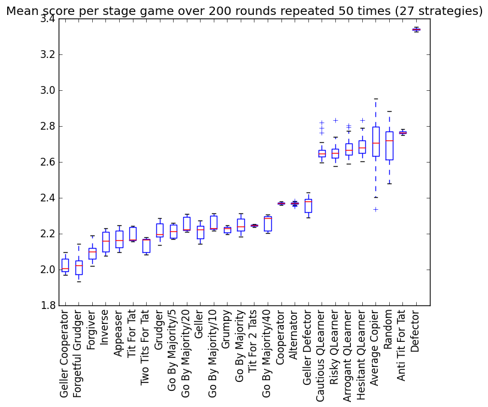

# Axelrod

A repository to reproduce Axelrod's iterated prisoner's dilemma.
**Please contribute strategies via pull request (or just get in touch with me).**

# History of Axelrod's tournament

In the 1980s, professor of Political Science Robert Axelrod ran a tournament inviting strategies from collaborators all over the world for the **Iterated Prisoner's Dilemma**.
You can read about this more [here](http://en.wikipedia.org/wiki/The_Evolution_of_Cooperation#Axelrod.27s_tournaments).

## The Prisoner's Dilemma

The [Prisoner's dilemma](http://en.wikipedia.org/wiki/Prisoner%27s_dilemma) is the simple two player game shown below:

          | Cooperate     | Defect        |
--------- | ------------- | ------------- |
Cooperate | (2,2)         | (0,5)         |
Defect    | (5,0)         | (4,4)         |

If both players cooperate they will each go to prison for 2 years.
If one cooperates and the other defects: the defector does not go to prison and the cooperator goes to prison for 5 years.
If both defect: they both go to prison for 4 years.

By simply investigating the best responses against both possible actions of each player it is immediate to see that the Nash equilibrium for this game is for both players to defect.

## The iterated Prisoner's Dilemma

We can use the basic Prisoner's Dilemma as a _stage_ game in a repeated game.
Players now aim to minimise the amount of time spent in prison over a repetition of the game.
Strategies can take in to account both players history and so can take the form:

> I will cooperate unless you defect 3 times in a row at which point I will defect forever.

Axelrod ran such a tournament (twice) and invited strategies from anyone who would contribute.
The tournament was a round robin and the winner was the strategy who had the lowest total amount of time in prison.

This tournament has been used to study how cooperation can evolve from a very simple set of rules.
This is mainly because the winner of both tournaments was 'tit for tat': a strategy that would never defect first (referred to as a 'nice' strategy).

# Results

This repository contains Python (2.7) code that reproduces the tournament.
To run the tournament, you simply need to:

```
$ python run_tournament.py
```

This automatically outputs a `png` file with the results.
You can see the results from the latest run of the tournament here:


As you can see: the 'tit for tat' strategy has not won in this instance, that is mainly because more strategies are needed to get anywhere near Axelrod's tournament.

You can see the results from the latest run of the tournament here with the cheating strategies (which manipulate/read what the opponent does):



Please do contribute :)

# Contributing

All contributions are welcome: with a particular emphasis on contributing further strategies.

The file structure is:

```
.
├── axelrod
│   └── __init__.py
│   └── tournament.py
│   └── /strategies/
│       └── __init__.py
│       └── cooperator.py
│       └── defector.py
│       └── grudger.py
│       └── titfortat.py
│       └── gobymajority.py
│   └── /tests/
│       └── test_*.py
└── README.md
└── run_tournament.py
```

To contribute a strategy you need to do 4 (optionally 6) things (all of which can actually be done right here using the github website):

1. Fork this repository.
2. Add a `<strategy>.py` file to the `strategies` directory. (Take a look at the others in there: you need to write code for the strategy and one other simple thing.)
3. Update the `./axelrod/strategies/__init__.py` file (you need to write the `import` statement and add the strategy to the relevant python list).
4. (This one is optional: write some unit tests in the `./axelrod/tests/` directory).
5. (This one is also optional: add your name to the contributors list down below. If you don't I'll try and do it myself).
6. Send me a pull request.

If any of these steps sound complicated please just get in touch with me and I would be delighted to help.
There is a [video](https://www.youtube.com/watch?v=5kOUVdktxAo&feature=youtu.be) and a [blog post](http://goo.gl/zkgSkc) discussing showing how to contribute if this is helpful.

If you would like to write/run tests this is how to run them:

```
$ python -m unittest discover axelrod/tests/
```

Note that this project is being taken care off by [travis-ci](https://travis-ci.org/), so tests will be run automatically when opening a pull request.
You can see the latest build status [here](https://travis-ci.org/drvinceknight/Axelrod).

All other contributions are of course welcome: if you can improve this in any way (from typos to better unit testing) please do :)

# Contributors

- [JasYoung314](https://github.com/JasYoung314)
- [Karlos78](https://github.com/Karlos78)
- [drvinceknight](https://twitter.com/drvinceknight)
- [geraintpalmer](https://github.com/geraintpalmer)
- [langner](https://github.com/langner)
- [martinjc](https://github.com/martinjc)
- [uglyfruitcake](https://github.com/uglyfruitcake)
- [jomuel](https://github.com/jomuel)
