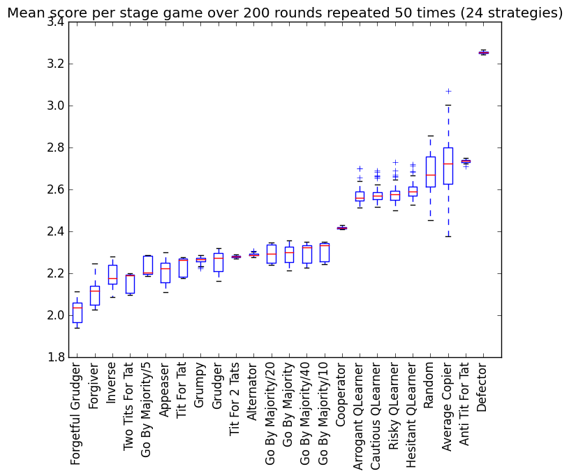

# Axelrod

A repository to reproduce Axelrod's iterated prisoner's dilemma.

# History

# Results

To run the tournament, you simply need to:

```
$ python run_tournament.py
```

This automatically outputs a `png` file with the results.
You can see the results from the latest run of the tournament here:



# Contributing

All contributions are welcome: with a particular emphasis on contributing further strategies.

The file structure is:

```
.
├── axelrod
│   └── __init__.py
│   └── tournament.py
│   └── /strategies/
│       └── __init__.py
│       └── cooperator.py
│       └── defector.py
│       └── grudger.py
│       └── titfortat.py
│       └── gobymajority.py
│   └── /tests/
└── README.md
└── run_tournament.py
```

To contribute a strategy you need to do 4 (optionally 5) thing:

1. Fork this repository.
2. Add a `<strategy>.py` file to the `strategies` directory.
3. Update the `./axelrod/stragies/__init__.py` file (you need to write the `import` statement and add the strategy to the relevant python list).
4. (This one is optional: write some unit tests in the `./axelrod/tests/` directory.
5. Send me a pull request.

If any of these steps sound complicated please just get in touch with me and I would be delighted to help.

All other contributions are of course welcome: if you can improve this in any way (from typos to better unit testing) please do :)

# License
