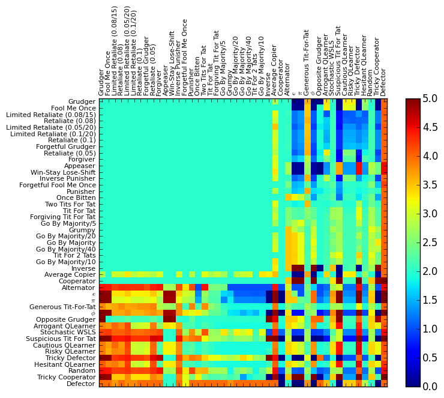

.. image:: https://badge.waffle.io/Axelrod-Python/Axelrod.svg?label=ready&title=Ready
    :target: https://waffle.io/Axelrod-Python/Axelrod

.. image:: https://coveralls.io/repos/Axelrod-Python/Axelrod/badge.svg
    :target: https://coveralls.io/r/Axelrod-Python/Axelrod

.. image:: https://img.shields.io/pypi/v/Axelrod.svg
    :target: https://pypi.python.org/pypi/Axelrod

.. image:: https://travis-ci.org/Axelrod-Python/Axelrod.svg?branch=packaging
    :target: https://travis-ci.org/Axelrod-Python/Axelrod

|Join the chat at https://gitter.im/Axelrod-Python/Axelrod|

Axelrod
=======

A repository with the following goals:

1. To enable the reproduction of previous Iterated Prisoner's Dilemma research as easily as possible.
2. To produce the de-facto tool for any future Iterated Prisoner's Dilemma research.
3. To provide as simple a means as possible for anyone to define and contribute
   new and original Iterated Prisoner's Dilemma strategies.

**Please contribute strategies via pull request (or just get in touch
with us).**

For an overview of how to use and contribute to this repository, see the
documentation: http://axelrod.readthedocs.org/

If you do use this library for your personal research we would love to hear
about it: please do add a link at the bottom of this README file (PR's welcome
or again, just let us know) :) If there is something that is missing in this
library and that you would like implemented so as to be able to carry out a
project please open an issue and let us know!

Installation
============

The simplest way to install is::

    $ pip install axelrod

Otherwise::

    $ git clone https://github.com/Axelrod-Python/Axelrod.git
    $ cd Axelrod
    $ python setup.py install

Results
=======

This repository contains Python (2.7) code that reproduces the
tournament. To run the tournament, you simply need to:

::

    $ python run_axelrod

This automatically outputs a ``png`` file with the results. You can see
the results from the latest run of the tournament here:

.. figure:: ./assets/strategies_boxplot.png
   :alt:

You can see the results from the latest run of the tournament here with
the cheating strategies (which manipulate/read what the opponent does):

.. figure:: ./assets/all_strategies_boxplot.png
   :alt:

Also the pairwise performance of each strategy versus all others:

Please do contribute :)

Note that you can run ``python run_axelrod -h`` for further
options available: for example, cheating strategies can be excluded for
faster results by running:

::

    $ python run_axelrod --xc --xa

You can also run the tournament in parallel (below will run 4 parallel
processes):

::

    $ python run_axelrod -p 4

You can run with all available CPUs with:

::

    $ python run_axelrod -p 0

Awesome visualisation
---------------------

`martinjc <https://github.com/martinjc>`__ put together a pretty awesome
visualisation of this using d3. Hosted on gh-pages it can be seen here:
`drvinceknight.github.io/Axelrod <http://drvinceknight.github.io/Axelrod/>`__.

Documentation
-------------

There is currently a very sparse set of documentation up here:
`axelrod.readthedocs.org/ <http://axelrod.readthedocs.org/>`__.

To write/render the documenation locally, you will need
`sphinx <http://sphinx-doc.org/>`__:

::

    $ pip install sphinx sphinx-autobuild mock

Once you have sphinx:

::

    $ cd docs
    $ make html

Contributing
============

All contributions are welcome: with a particular emphasis on
contributing further strategies.

You can find helpful instructions about contributing in the
documentation:
http://axelrod.readthedocs.org/en/latest/contributing.html.

.. image:: https://graphs.waffle.io/Axelrod-Python/Axelrod/throughput.svg
 :target: https://waffle.io/Axelrod-Python/Axelrod/metrics
  :alt: 'Throughput Graph'

Contributors
============

-  `JasYoung314 <https://github.com/JasYoung314>`__
-  `Karlos78 <https://github.com/Karlos78>`__
-  `drvinceknight <https://twitter.com/drvinceknight>`__
-  `geraintpalmer <https://github.com/geraintpalmer>`__
-  `hollymarissa <https://github.com/hollymarissa>`__
-  `jomuel <https://github.com/jomuel>`__
-  `langner <https://github.com/langner>`__
-  `marcharper <https://github.com/marcharper>`__
-  `martinjc <https://github.com/martinjc>`__
-  `meatballs <https://github.com/meatballs>`__
-  `theref <https://github.com/theref>`__
-  `timothyf1 <https://github.com/timothyf1>`__
-  `uglyfruitcake <https://github.com/uglyfruitcake>`__
-  `pmslavin <https://github.com/pmslavin>`__

Projects that use this library
==============================

If you happen to use this library for anything from a blog post to a research
paper please list it here:

- `A 2015 pedagogic paper on active learning
  <https://github.com/drvinceknight/Playing-games-a-case-study-in-active-learning>`_
  by `drvinceknight <https://twitter.com/drvinceknight>`_ published in `MSOR
  Connections <https://journals.gre.ac.uk/index.php/msor/about>`_: the library
  is mentioned briefly as a way of demonstrating repeated games.
- `A repository with various example tournaments and visualizations of strategies
  <https://github.com/marcharper/AxelrodExamples>`_
  by `marcharper <https://github.com/marcharper>`_.
- `Axelrod-Python related blog articles
  <http://www.thomascampbell.me.uk/category/axelrod.html>`_
  by `Uglyfruitcake <https://github.com/uglyfruitcake>`_.

.. |Join the chat at https://gitter.im/Axelrod-Python/Axelrod| image:: https://badges.gitter.im/Join%20Chat.svg
   :target: https://gitter.im/Axelrod-Python/Axelrod?utm_source=badge&utm_medium=badge&utm_campaign=pr-badge&utm_content=badge
