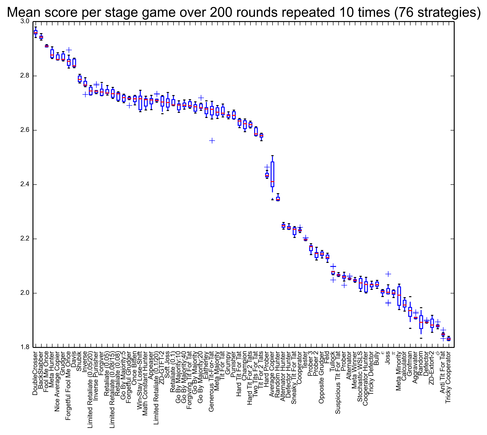
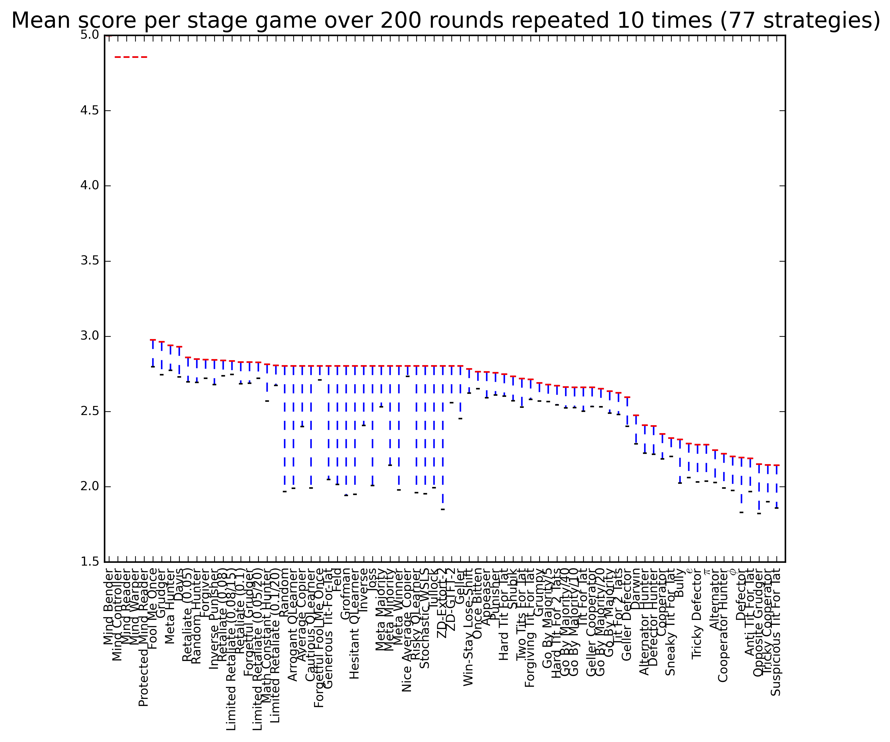

|Join the chat at https://gitter.im/drvinceknight/Axelrod|

.. image:: https://travis-ci.org/drvinceknight/Axelrod.svg?branch=packaging
    :target: https://travis-ci.org/drvinceknight/Axelrod

Axelrod
=======

A repository to reproduce Axelrod's iterated prisoner's dilemma.
**Please contribute strategies via pull request (or just get in touch
with me).**

For an overview of how to use and contribute to this repository, see the
documentation: http://axelrod.readthedocs.org/

Results
=======

This repository contains Python (2.7) code that reproduces the
tournament. To run the tournament, you simply need to:

::

    $ python run_tournament.py

This automatically outputs a ``png`` file with the results. You can see
the results from the latest run of the tournament here:

As you can see: the 'tit for tat' strategy has not won in this instance,
that is mainly because more strategies are needed to get anywhere near
Axelrod's tournament.

You can see the results from the latest run of the tournament here with
the cheating strategies (which manipulate/read what the opponent does):

Please do contribute :)

Note that you can run ``python run_tournament.py -h`` for further
options available: for example, cheating strategies can be excluded for
faster results by running:

::

    $ python run_tournament.py --xc --xa

You can also run the tournament in parallel (below will run 4 parallel
processes):

::

    $ python run_tournament.py -p 4

You can run with all available CPUs with:

::

    $ python run_tournament.py -p 0

Awesome visualisation
---------------------

`martinjc <https://github.com/martinjc>`__ put together a pretty awesome
visualisation of this using d3. Hosted on gh-pages it can be seen here:
`drvinceknight.github.io/Axelrod <http://drvinceknight.github.io/Axelrod/>`__.

Documentation
-------------

There is currently a very sparse set of documentation up here:
`axelrod.readthedocs.org/ <http://axelrod.readthedocs.org/>`__.

To write/render the documenation locally, you will need
`sphinx <http://sphinx-doc.org/>`__:

::

    $ pip install sphinx sphinx-autobuild

Once you have sphinx:

::

    $ cd docs
    $ make html

Contributing
============

All contributions are welcome: with a particular emphasis on
contributing further strategies.

You can find helpful instructions about contributing in the
documentation:
http://axelrod.readthedocs.org/en/latest/contributing.html.

Contributors
============

-  `JasYoung314 <https://github.com/JasYoung314>`__
-  `Karlos78 <https://github.com/Karlos78>`__
-  `drvinceknight <https://twitter.com/drvinceknight>`__
-  `geraintpalmer <https://github.com/geraintpalmer>`__
-  `hollymarissa <https://github.com/hollymarissa>`__
-  `jomuel <https://github.com/jomuel>`__
-  `langner <https://github.com/langner>`__
-  `marcharper <https://github.com/marcharper>`__
-  `martinjc <https://github.com/martinjc>`__
-  `meatballs <https://github.com/meatballs>`__
-  `theref <https://github.com/theref>`__
-  `timothyf1 <https://github.com/timothyf1>`__
-  `uglyfruitcake <https://github.com/uglyfruitcake>`__
-  `pmslavin <https://github.com/pmslavin>`__

.. |Join the chat at https://gitter.im/drvinceknight/Axelrod| image:: https://badges.gitter.im/Join%20Chat.svg
   :target: https://gitter.im/drvinceknight/Axelrod?utm_source=badge&utm_medium=badge&utm_campaign=pr-badge&utm_content=badge
