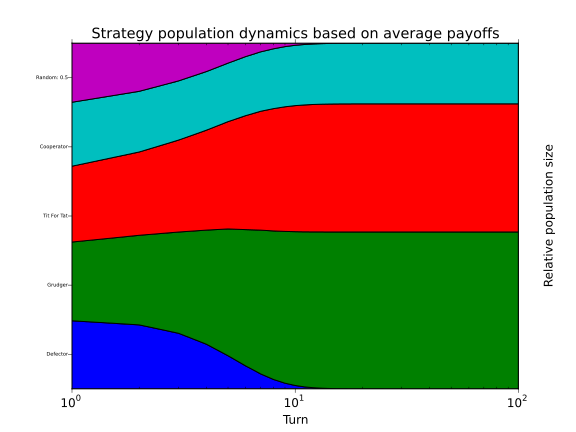

.. _ecological-variant:

Ecological Variant
==================

In Axelrod's original work an ecological approach based on the payoff matrix of
the tournament was used to study the evolutionary stability of each strategy.
Whilst this bears some comparison to the :ref:`moran-process`, the latter is
much more widely used in the literature.

To study the evolutionary stability of each strategy it is possible to create an
ecosystem based on the payoff matrix of a tournament::

    >>> import axelrod as axl
    >>> players = [axl.Cooperator(), axl.Defector(),
    ...            axl.TitForTat(), axl.Grudger(),
    ...            axl.Random()]
    >>> tournament = axl.Tournament(players)
    >>> results = tournament.play()
    >>> eco = axl.Ecosystem(results)
    >>> eco.reproduce(100) # Evolve the population over 100 time steps

Here is how we obtain a nice stackplot of the system evolving over time::

    >>> plot = axl.Plot(results)
    >>> p = plot.stackplot(eco)
    >>> p.show()

