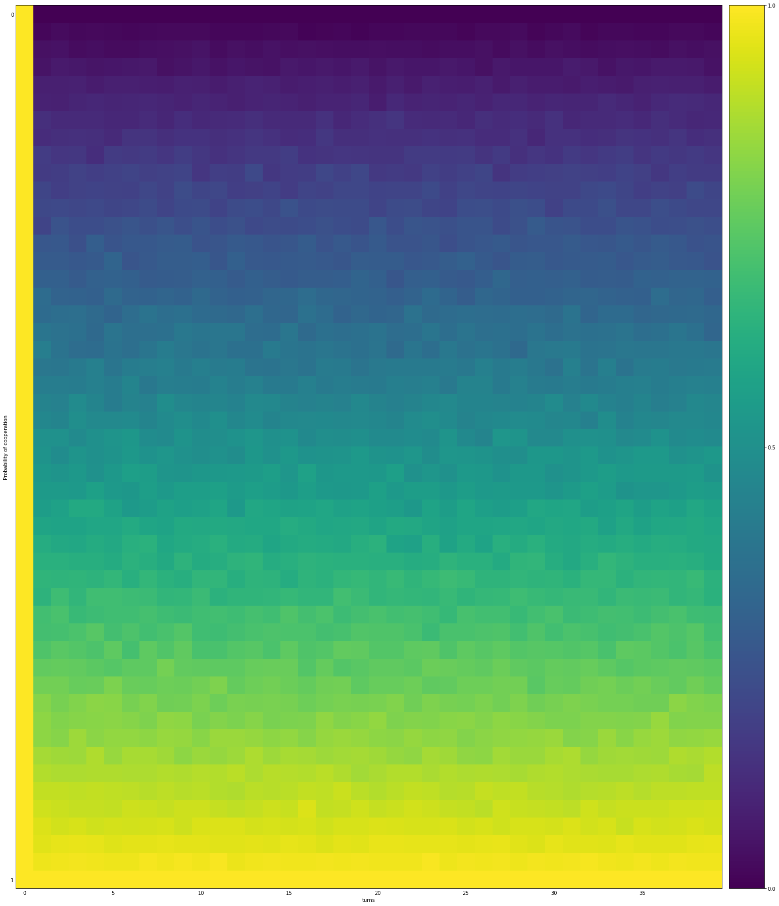
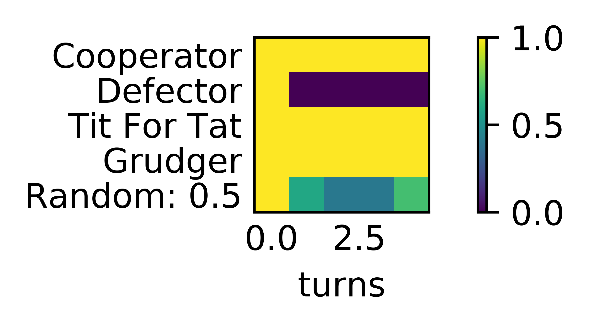

.. _fingerprinting:

Fingerprinting
==============

Ashlock Fingerprints
--------------------

In [Ashlock2008]_, [Ashlock2009]_ a methodology for obtaining visual
representation of a strategy's behaviour is described.  The basic method is to
play the strategy against a probe strategy with varying noise parameters.
These noise parameters are implemented through the :code:`JossAnnTransformer`.
The Joss-Ann of a strategy is a new strategy which has a probability :code:`x`
of cooperating, a probability :code:`y` of defecting, and otherwise uses the
response appropriate to the original strategy.  We can then plot the expected
score of the strategy against :code:`x` and :code:`y` and obtain a heat plot
over the unit square.  When :code:`x + y >= 1` the :code:`JossAnn` is created
with parameters :code:`(1-y, 1-x)` and plays against the Dual of the probe
instead. A full definition and explanation is given in
[Ashlock2008]_, [Ashlock2009]_.

Here is how to create a fingerprint of :code:`WinStayLoseShift` using
:code:`TitForTat` as a probe::

    >>> import axelrod as axl
    >>> axl.seed(0)  # Fingerprinting is a random process
    >>> strategy = axl.WinStayLoseShift
    >>> probe = axl.TitForTat
    >>> af = axl.AshlockFingerprint(strategy, probe)
    >>> data = af.fingerprint(turns=10, repetitions=2, step=0.2)
    >>> data
    {...
    >>> data[(0, 0)]
    3.0

The :code:`fingerprint` method returns a dictionary mapping coordinates of the
form :code:`(x, y)` to the mean score for the corresponding interactions.
We can then plot the above to get::

    >>> p = af.plot()
    >>> p.show()

.. image:: _static/fingerprinting/WSLS_small.png
     :width: 100%
     :align: center

In reality we would need much more detail to make this plot useful.

Running the above with the following parameters::

    >>> af.fingerprint(turns=50, repetitions=2, step=0.01)  # doctest: +SKIP

We get the plot:

.. image:: _static/fingerprinting/WSLS_large.png
     :width: 100%
     :align: center

We are also able to specify a matplotlib colour map, interpolation and can
remove the colorbar and axis labels::

    >>> p = af.plot(cmap='PuOr', interpolation='bicubic', colorbar=False, labels=False)  # doctest: +SKIP
    >>> p.show()

.. image:: _static/fingerprinting/WSLS_large_alt.png
     :width: 100%
     :align: center

Note that it is also possible to pass a player instance to be fingerprinted
and/or as a probe.
This allows for the fingerprinting of parametrized strategies::

    >>> axl.seed(0)
    >>> player = axl.Random(p=.1)
    >>> probe = axl.GTFT(p=.9)
    >>> af = axl.AshlockFingerprint(player, probe)
    >>> data = af.fingerprint(turns=10, repetitions=2, step=0.2)
    >>> data
    {...
    >>> data[(0, 0)]
    4.4...

Transitive Fingerprint
-----------------------

Another implemented fingerprint is the transitive fingerprint. The
transitive fingerprint represents the cooperation rate of a strategy against a
set of opponents over a number of turns.

By default the set of opponents consists of :code:`50` Random players that
cooperate with increasing probability. This is how to obtain the transitive
fingerprint for :code:`TitForTat`::

     >>> axl.seed(0)
     >>> player = axl.TitForTat()
     >>> tf = axl.TransitiveFingerprint(player)
     >>> data = tf.fingerprint(turns=40)

The data produced is a :code:`numpy` array showing the cooperation rate against
a given opponent (row) in a given turn (column)::

     >>> data.shape
     (50, 40)

It is also possible to visualise the fingerprint::

    >>> p = tf.plot()
    >>> p.show()

It is also possible to fingerprint against a given set of opponents::

     >>> axl.seed(1)
     >>> opponents = [s() for s in axl.demo_strategies]
     >>> tf = axl.TransitiveFingerprint(player, opponents=opponents)
     >>> data = tf.fingerprint(turns=5, repetitions=10)

The name of the opponents can be displayed in the plot::

     >>> p = tf.plot(display_names=True)
     >>> p.show()

