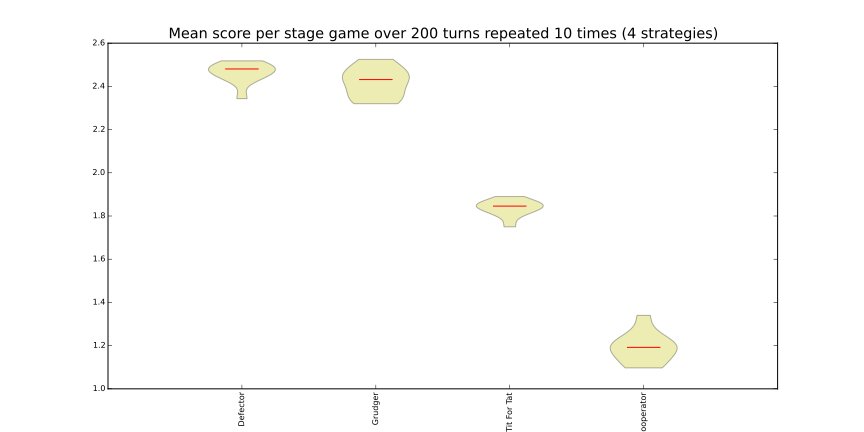
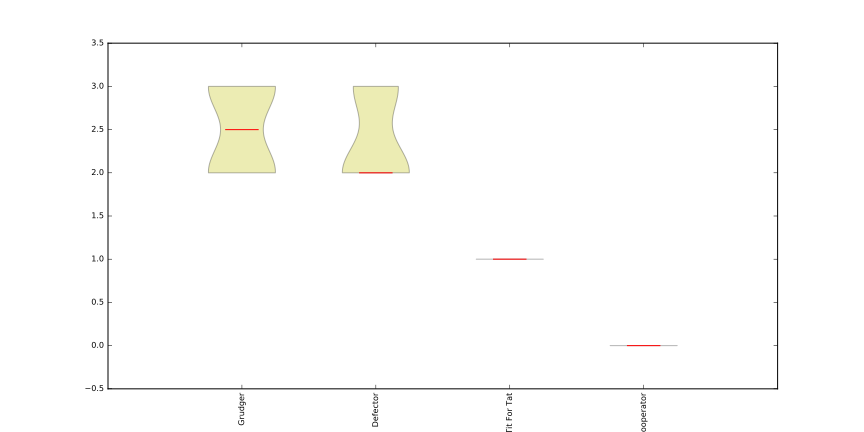

Noisy tournaments
=================

A common variation on iterated prisoner’s dilemma tournaments is to add
stochasticity in the choice of actions, simply called noise. This noise is
introduced by flipping plays between ‘C’ and ‘D’ with some probability that is
applied to all plays after they are delivered by the player.

The presence of this persistent background noise causes some strategies to
behave substantially differently. For example, :code:`TitForTat` can fall into
defection loops with itself when there is noise. While :code:`TitForTat` would
usually cooperate well with itself::

    C C C C C ...
    C C C C C ...

Noise can cause a C to flip to a D (or vice versa), disrupting the cooperative
chain::

    C C C D C D C D D D ...
    C C C C D C D D D D ...

To create a noisy tournament you simply need to add the `noise` argument::

    >>> import axelrod as axl
    >>> players = [axl.Cooperator(), axl.Defector(),
    ...            axl.TitForTat(), axl.Grudger()]
    >>> noise = 0.1
    >>> tournament = axl.Tournament(players, noise=noise)
    >>> results = tournament.play()
    >>> plot = axl.Plot(results)
    >>> p = plot.boxplot()
    >>> p.show()

Here is how the distribution of wins now looks::

    >>> p = plot.winplot()
    >>> p.show()

