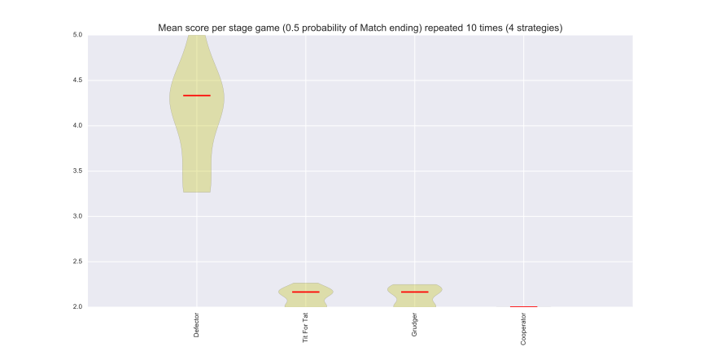
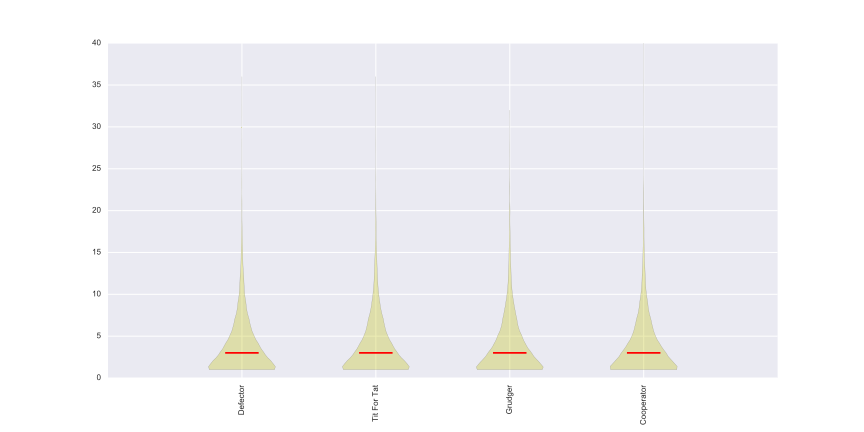

Probabilistic Ending Tournaments
================================

It is possible to create a tournament where the length of each Match is not
constant for all encounters: after each turn the Match ends with a given
probability::

    >>> import axelrod as axl
    >>> players = [axl.Cooperator(), axl.Defector(),
    ...            axl.TitForTat(), axl.Grudger()]
    >>> tournament = axl.ProbEndTournament(players, prob_end=0.5)

We can view the results in a similar way as described in
:ref:`tournament-results`::

    >>> results = tournament.play()
    >>> m = results.payoff_matrix
    >>> for row in m:  # doctest: +SKIP
    ...     print([round(ele, 1) for ele in row]) # Rounding output  # doctest: +SKIP

    [3.0, 0.0, 3.0, 3.0]
    [5.0, 1.0, 3.7, 3.6]
    [3.0, 0.3, 3.0, 3.0]
    [3.0, 0.4, 3.0, 3.0]

We see that :code:`Cooperator` always scores 0 against :code:`Defector` but
other scores seem variable as they are effected by the length of each match.

We can (as before) obtain the ranks for our players::

    >>> results.ranked_names  # doctest: +SKIP
    ['Defector', 'Tit For Tat', 'Grudger', 'Cooperator']

We can plot the results::

    >>> plot = axl.Plot(results)
    >>> p = plot.boxplot()
    >>> p.show()

We can also view the length of the matches played by each player. The plot shows
that the length of each match (for each player) is not the same. The median
length is 4 which is the expected value with the probability of a match ending
being :code:`0.5`.

    >>> p = plot.lengthplot()
    >>> p.show()

