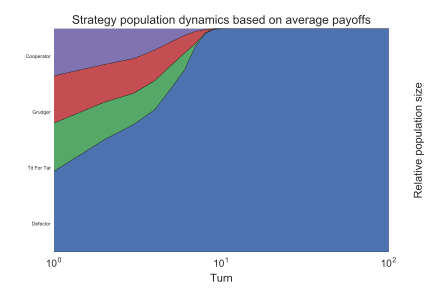
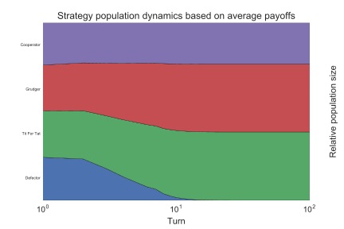

Probabilistic Ending Tournaments
================================

It is possible to create a tournament where the length of each Match is not
constant for all encounters: after each turn the Match ends with a given
probability::

    >>> import axelrod as axl
    >>> strategies = [axl.Cooperator(), axl.Defector(),
    ...               axl.TitForTat(), axl.Grudger()]
    >>> tournament = axl.ProbEndTournament(strategies, prob_end=0.5)

We can view the results in a similar way as for described in
:ref:`payoff-matrix`::

    >>> results = tournament.play()
    >>> m = results.payoff_matrix
    >>> for row in m:  # doctest: +SKIP
    ...     print([round(ele, 1) for ele in row]) # Rounding output  # doctest: +SKIP

    [3.0, 0.0, 3.0, 3.0]
    [5.0, 1.0, 3.7, 3.6]
    [3.0, 0.3, 3.0, 3.0]
    [3.0, 0.4, 3.0, 3.0]

We see that :code:`Cooperator` always scores 0 against :code:`Defector` but
other scores seem variable as they are effected by the length of each match.

We can (as before) obtain the ranks for our players::

    >>> results.ranked_names  # doctest: +SKIP
    ['Defector', 'Tit For Tat', 'Grudger', 'Cooperator']

We can plot the results::

    >>> plot = axl.Plot(results)
    >>> p = plot.boxplot()
    >>> p.show()

.. image:: _static/prob_end_tournaments/prob_end_boxplot.svg
   :width: 50%
   :align: center

We can also view the length of the matches player by each player (here plotted
with a high number of repetitions we see that the expected length of Match is
obtained :math:`\approx 4`)::

    >>> p = plot.lengthplot()
    >>> p.show()

.. image:: _static/prob_end_tournaments/prob_end_lengthplot.svg
   :width: 50%
   :align: center

Just as for a constant length tournament and as described in
:ref:`ecological-variant` we can look at the strategies in an evolutionary
context::

    >>> eco = axl.Ecosystem(results)
    >>> eco.reproduce(100)
    >>> p = plot.stackplot(eco)
    >>> p.show()

Note that if we repeat the above but using a much lower probability of the
match ending (thus increasing the importance of reputation)::

    >>> tournament = axl.ProbEndTournament(strategies, prob_end=0.01)
    >>> results = tournament.play()
    >>> eco = axl.Ecosystem(results)
    >>> eco.reproduce(100)
    >>> p = plot.stackplot(eco)
    >>> p.show()

We see that the :code:`Cooperation` now takes over:

