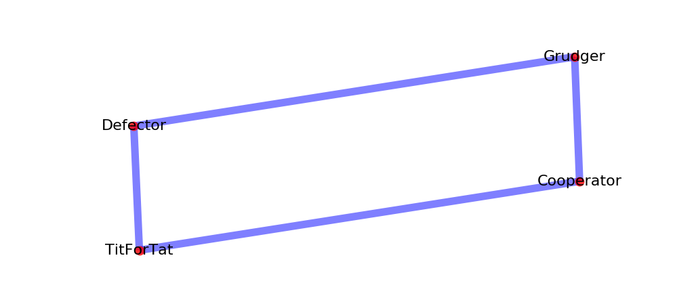
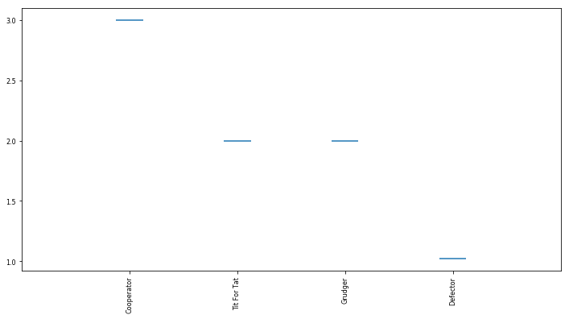

Spatial tournaments
===================

A spatial tournament is defined on a graph where the nodes correspond to players
and edges define whether or not a given player pair will have a match.

The initial work on spatial tournaments was done by Nowak and May in a 1992
paper: [Nowak1992]_.

Additionally, Szabó and Fáth in their 2007 paper [Szabó1992]_ consider a variety
of graphs, such as lattices, small world, scale-free graphs and evolving
networks.

Let's create a tournament where :code:`Cooperator` and :code:`Defector` do not
play each other and neither do :code:`TitForTat` and :code:`Grudger` :

Note that the edges have to be given as a list of tuples of player
indices::

  >>> import axelrod as axl
  >>> players = [axl.Cooperator(), axl.Defector(),
  ...            axl.TitForTat(), axl.Grudger()]
  >>> edges = [(0, 2), (0, 3), (1, 2), (1, 3)]

To create a spatial tournament you call the :code:`SpatialTournamnent` class::

    >>> spatial_tournament = axl.SpatialTournament(players, edges=edges)
    >>> results = spatial_tournament.play(keep_interactions=True)

We can plot the results::

    >>> plot = axl.Plot(results)
    >>> p = plot.boxplot()
    >>> p.show()

We can, like any other tournament, obtain the ranks for our players::

   >>> results.ranked_names
   ['Cooperator', 'Tit For Tat', 'Grudger', 'Defector']

Let's run a small tournament of 2 :code:`turns` and 5 :code:`repetitions`
and obtain the interactions::

    >>> spatial_tournament = axl.SpatialTournament(players ,turns=2, repetitions=2, edges=edges)
    >>> results = spatial_tournament.play(keep_interactions=True)
    >>> for index_pair, interaction in results.interactions.items():
    ...     player1 = spatial_tournament.players[index_pair[0]]
    ...     player2 = spatial_tournament.players[index_pair[1]]
    ...     print('%s vs %s: %s' % (player1, player2, interaction))
    Defector vs Tit For Tat: [[('D', 'C'), ('D', 'D')], [('D', 'C'), ('D', 'D')]]
    Cooperator vs Grudger: [[('C', 'C'), ('C', 'C')], [('C', 'C'), ('C', 'C')]]
    Defector vs Grudger: [[('D', 'C'), ('D', 'D')], [('D', 'C'), ('D', 'D')]]
    Cooperator vs Tit For Tat: [[('C', 'C'), ('C', 'C')], [('C', 'C'), ('C', 'C')]]

As anticipated  :code:`Cooperator` does not interact with :code:`Defector` neither
:code:`TitForTat` with :code:`Grudger`.

It is also possible to create a probabilistic ending spatial tournament with the
:code:`ProbEndSpatialTournament` class::

    >>> prob_end_spatial_tournament = axl.ProbEndSpatialTournament(players, edges=edges, prob_end=.1, repetitions=1)
    >>> prob_end_results = prob_end_spatial_tournament.play(keep_interactions=True)

We see that the match lengths are no longer all equal::

    >>> axl.seed(0)
    >>> lengths = []
    >>> for interaction in prob_end_results.interactions.values():
    ...     lengths.append(len(interaction[0]))
    >>> min(lengths) != max(lengths)
    True
