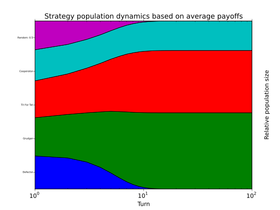

.. _ecological-variant:

Ecological Variant
==================

To study the evolutionary stability of each strategy it is possible to create an
ecosystem based on the payoff matrix of a tournament::

    >>> import axelrod as axl
    >>> strategies = [axl.Cooperator(), axl.Defector(),
    ...               axl.TitForTat(), axl.Grudger(),
    ...               axl.Random()]
    >>> tournament = axl.Tournament(strategies)
    >>> results = tournament.play()
    >>> eco = axl.Ecosystem(results)
    >>> eco.reproduce(100) # Evolve the population over 100 time steps

Here is how we obtain a nice stackplot of the system evolving over time::

    >>> plot = axl.Plot(results)
    >>> p = plot.stackplot(eco)
    >>> p.show()

