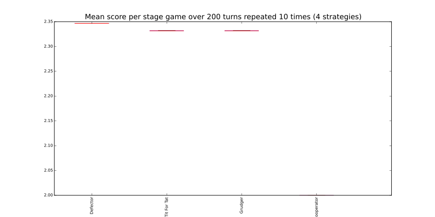

.. _getting-started:

Getting started
===============

Installation
------------

The simplest way to install the package is to obtain it from the PyPi
repository::

    $ pip install axelrod

You can also build it from source if you would like to::

    $ git clone https://github.com/Axelrod-Python/Axelrod.git
    $ cd Axelrod
    $ python setup.py install

If you do this you will need to also install the dependencies::

    $ pip install -r requirements.txt

Creating and running a simple tournament
----------------------------------------

The following lines of code creates a list players playing simple
strategies::

    >>> import axelrod as axl
    >>> strategies = [axl.Cooperator(), axl.Defector(),
    ...               axl.TitForTat(), axl.Grudger()]
    >>> strategies
    [Cooperator, Defector, Tit For Tat, Grudger]

We can now create a tournament, play it, save the results and view the rank of
each player::

    >>> tournament = axl.Tournament(strategies)
    >>> results = tournament.play()
    >>> results.ranked_names
    ['Defector', 'Tit For Tat', 'Grudger', 'Cooperator']

We can also plot these results::

    >>> plot = axl.Plot(results)
    >>> p = plot.boxplot()
    >>> p.show()

Note that in this case none of our strategies are stochastic so the boxplot
shows that there is no variation. Take a look at the :ref:`visualising-results`
section to see plots showing a stochastic effect.
