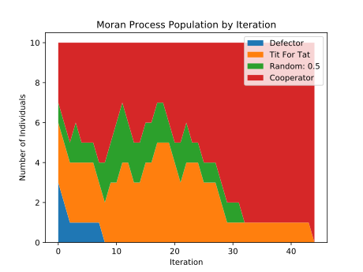

.. _moran-process:

Moran Process
=============

The strategies in the library can be pitted against one another in the
`Moran process <https://en.wikipedia.org/wiki/Moran_process>`_, a population
process simulating natural selection.

The process works as follows. Given an
initial population of players, the population is iterated in rounds consisting
of:

- matches played between each pair of players, with the cumulative total
  scores recorded
- a player is chosen to reproduce proportional to the player's score in the
  round
- a player is chosen at random to be replaced

The process proceeds in rounds until the population consists of a single player
type. That type is declared the winner. To run an instance of the process with
the library, proceed as follows::

    >>> import axelrod as axl
    >>> axl.seed(0)  # for reproducible example
    >>> players = [axl.Cooperator(), axl.Defector(),
    ...            axl.TitForTat(), axl.Grudger()]
    >>> mp = axl.MoranProcess(players)
    >>> populations = mp.play()
    >>> mp.winning_strategy_name
    'Defector'

You can access some attributes of the process, such as the number of rounds::

    >>> len(mp)
    16

The sequence of populations::

    >>> import pprint
    >>> pprint.pprint(populations)  # doctest: +SKIP
    [Counter({'Defector': 1, 'Tit For Tat': 1, 'Grudger': 1, 'Cooperator': 1}),
     Counter({'Defector': 1, 'Tit For Tat': 1, 'Grudger': 1, 'Cooperator': 1}),
     Counter({'Cooperator': 2, 'Defector': 1, 'Tit For Tat': 1}),
     Counter({'Defector': 2, 'Cooperator': 2}),
     Counter({'Cooperator': 3, 'Defector': 1}),
     Counter({'Cooperator': 3, 'Defector': 1}),
     Counter({'Defector': 2, 'Cooperator': 2}),
     Counter({'Defector': 3, 'Cooperator': 1}),
     Counter({'Defector': 3, 'Cooperator': 1}),
     Counter({'Defector': 3, 'Cooperator': 1}),
     Counter({'Defector': 3, 'Cooperator': 1}),
     Counter({'Defector': 3, 'Cooperator': 1}),
     Counter({'Defector': 3, 'Cooperator': 1}),
     Counter({'Defector': 3, 'Cooperator': 1}),
     Counter({'Defector': 3, 'Cooperator': 1}),
     Counter({'Defector': 4})]

The scores in each round::

    >>> for row in mp.score_history:
    ...     print([round(element, 1) for element in row])
    [6.0, 7.0, 7.0, 7.0]
    [6.0, 7.0, 7.0, 7.0]
    [6.0, 11.0, 7.0, 6.0]
    [3.0, 11.0, 11.0, 3.0]
    [6.0, 15.0, 6.0, 6.0]
    [6.0, 15.0, 6.0, 6.0]
    [3.0, 11.0, 11.0, 3.0]
    [7.0, 7.0, 7.0, 0.0]
    [7.0, 7.0, 7.0, 0.0]
    [7.0, 7.0, 7.0, 0.0]
    [7.0, 7.0, 7.0, 0.0]
    [7.0, 7.0, 7.0, 0.0]
    [7.0, 7.0, 7.0, 0.0]
    [7.0, 7.0, 7.0, 0.0]
    [7.0, 7.0, 7.0, 0.0]

We can plot the results of a Moran process with `mp.populations_plot()`. Let's
use a larger population to get a bit more data::

    >>> import random
    >>> import matplotlib.pyplot as plt
    >>> axl.seed(15)  # for reproducible example
    >>> players = [axl.Defector(), axl.Defector(), axl.Defector(),
    ...        axl.Cooperator(), axl.Cooperator(), axl.Cooperator(),
    ...        axl.TitForTat(), axl.TitForTat(), axl.TitForTat(),
    ...        axl.Random()]
    >>> mp = axl.MoranProcess(players=players, turns=200)
    >>> populations = mp.play()
    >>> mp.winning_strategy_name
    'Cooperator'
    >>> ax = mp.populations_plot()
    >>> plt.show()  #doctest: +SKIP

The :code:`MoranProcess` class also accepts an argument for a mutation rate.
Nonzero mutation changes the Markov process so that it no longer has absorbing
states, and will iterate forever. To prevent this, iterate with a loop (or
function like :code:`takewhile` from :code:`itertools`)::

    >>> import axelrod as axl
    >>> axl.seed(4)  # for reproducible example
    >>> players = [axl.Cooperator(), axl.Defector(),
    ...            axl.TitForTat(), axl.Grudger()]
    >>> mp = axl.MoranProcess(players, mutation_rate=0.1)
    >>> for _ in mp:
    ...     if len(mp.population_distribution()) == 1:
    ...         break
    >>> mp.population_distribution()
    Counter({'Grudger': 4})

It is possible to pass a fitness function that scales the utility values. A common one
used in the literature, [Ohtsuki2006]_, is :math:`f(s) = 1 - w + ws` where :math:`w`
denotes the intensity of selection::

    >>> axl.seed(689)
    >>> players = (axl.Cooperator(), axl.Defector(), axl.Defector(), axl.Defector())
    >>> w = 0.95
    >>> fitness_transformation = lambda score: 1 - w + w * score
    >>> mp = axl.MoranProcess(players, turns=10, fitness_transformation=fitness_transformation)
    >>> populations = mp.play()
    >>> mp.winning_strategy_name
    'Cooperator'

Other types of implemented Moran processes:

- :ref:`moran-process-on-graphs`
- :ref:`approximate-moran-process`
