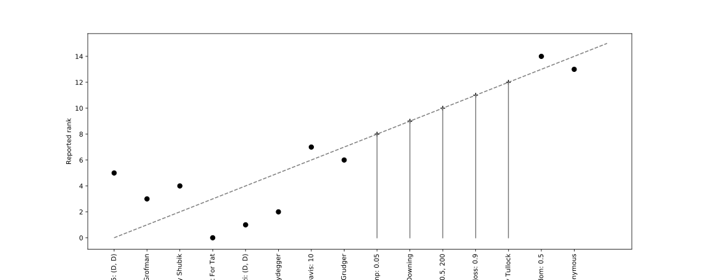

.. _running_axelrods_first_tournament:

Running Axelrod's First Tournament
==================================

This tutorial will bring together topics from the previous tutorials to
reproduce Axelrod's original tournament from [Axelrod1980]_.

Selecting our players
---------------------

We will use the players from Axelrod's first tournament which are contained
in the `axelrod.axelrod_first_strategies` list::

    >>> import axelrod as axl
    >>> first_tournament_participants_ordered_by_reported_rank = [s() for s in axl.axelrod_first_strategies]
    >>> number_of_strategies = len(first_tournament_participants_ordered_by_reported_rank)
    >>> for player in first_tournament_participants_ordered_by_reported_rank:
    ...     print(player)
    Tit For Tat
    First by Tideman and Chieruzzi: (D, D)
    First by Nydegger
    First by Grofman
    First by Shubik
    First by Stein and Rapoport: 0.05: (D, D)
    Grudger
    First by Davis: 10
    First by Graaskamp: 0.05
    First by Downing
    First by Feld: 1.0, 0.5, 200
    First by Joss: 0.9
    First by Tullock
    First by Anonymous
    Random: 0.5

Creating the tournament
-----------------------

Now we create and run the tournament, we will set a seed to ensure
reproducibility and 5 repetitions to smooth the random effects. We use 5
repetitions as this is what was done in [Axelrod1980]_::

    >>> tournament = axl.Tournament(
    ...      players=first_tournament_participants_ordered_by_reported_rank,
    ...      turns=200,
    ...      repetitions=5,
    ...      seed=1,
    ... )
    >>> results = tournament.play()

Viewing the ranks of the participants
-------------------------------------

The results object contains the ranked names::

    >>> for name in results.ranked_names:
    ...     print(name)
    First by Stein and Rapoport: 0.05: (D, D)
    First by Grofman
    First by Shubik
    Tit For Tat
    First by Nydegger
    First by Tideman and Chieruzzi: (D, D)
    Grudger
    First by Davis: 10
    First by Graaskamp: 0.05
    First by Downing
    First by Feld: 1.0, 0.5, 200
    First by Tullock
    First by Joss: 0.9
    First by Anonymous
    Random: 0.5

We see that `TitForTat` does not win. In fact `TitForTat` typically does not
win this tournament, possibly because our implementations differ from the original
strategies as their code is not available.

We can plot the reported rank (from [Axelrod1980]_) versus the reproduced one::

    >>> import matplotlib.pyplot as plt
    >>> plt.figure(figsize=(15, 6)) # doctest: +SKIP
    >>> plt.plot((0, 15), (0, 15), color="grey", linestyle="--")  # doctest: +SKIP
    >>> for original_rank, strategy in enumerate(first_tournament_participants_ordered_by_reported_rank):
    ...     rank = results.ranked_names.index(str(strategy))
    ...     if rank == original_rank:
    ...         symbol = "+"
    ...         plt.plot((rank, rank), (rank, 0), color="grey")
    ...     else:
    ...         symbol = "o"
    ...     plt.scatter([rank], [original_rank], marker=symbol, color="black", s=50)  # doctest: +SKIP
    >>> plt.xticks(
    ...     range(number_of_strategies),
    ...     results.ranked_names,
    ...     rotation=90
    ... )  # doctest: +SKIP
    >>> plt.ylabel("Reported rank")  # doctest: +SKIP
    >>> plt.xlabel("Reproduced rank");  # doctest: +SKIP
    >>> plt.show()

Visualising the scores
----------------------

We see that the first 6 strategies do not match the ranks of the original paper,
we can take a look the variation in the scores::

    >>> plot = axl.Plot(results)
    >>> p = plot.boxplot()
    >>> p.show()

.. image:: _static/running_axelrods_first_tournament/boxplot.svg
   :width: 75%
   :align: center

The first 6 strategies have similar scores which could indicate that the
original work by Axelrod was not run with sufficient repetitions. Another
explanation is that all the strategies are implemented from the descriptions
given in [Axelrod1980]_ and there is no source code to base this on. This leads
to some strategies being ambiguous. These are all clearly explained in the
strategy docstrings. For example::

    >>> print(axl.FirstByAnonymous.__doc__)
    <BLANKLINE>
        Submitted to Axelrod's first tournament by a graduate student whose name was
        withheld.
    <BLANKLINE>
        The description written in [Axelrod1980]_ is:
    <BLANKLINE>
        > "This rule has a probability of cooperating, P, which is initially 30% and
        > is updated every 10 moves. P is adjusted if the other player seems random,
        > very cooperative, or very uncooperative. P is also adjusted after move 130
        > if the rule has a lower score than the other player. Unfortunately, the
        > complex process of adjustment frequently left the probability of cooperation
        > in the 30% to 70% range, and therefore the rule appeared random to many
        > other players."
    <BLANKLINE>
        Given the lack of detail this strategy is implemented based on the final
        sentence of the description which is to have a cooperation probability that
        is uniformly random in the 30 to 70% range.
    <BLANKLINE>
        Names:
    <BLANKLINE>
        - (Name withheld): [Axelrod1980]_
    <BLANKLINE>

Other outcomes
--------------

If we run the tournament with other seeds, the results are different. For
example, with `1408` Tit For Tat wins::

    >>> tournament = axl.Tournament(
    ...      players=first_tournament_participants_ordered_by_reported_rank,
    ...      turns=200,
    ...      repetitions=5,
    ...      seed=1408,
    ... )
    >>> results = tournament.play()
    >>> for name in results.ranked_names:
    ...     print(name)
    Tit For Tat
    First by Stein and Rapoport: 0.05: (D, D)
    First by Grofman
    First by Shubik
    First by Tideman and Chieruzzi: (D, D)
    First by Nydegger
    Grudger
    First by Davis: 10
    First by Graaskamp: 0.05
    First by Downing
    First by Feld: 1.0, 0.5, 200
    First by Tullock
    First by Joss: 0.9
    First by Anonymous
    Random: 0.5

With `136` the strategy submitted by Grofman wins::

    >>> tournament = axl.Tournament(
    ...      players=first_tournament_participants_ordered_by_reported_rank,
    ...      turns=200,
    ...      repetitions=5,
    ...      seed=136
    ... )
    >>> results = tournament.play()
    >>> for name in results.ranked_names:
    ...     print(name)
    First by Grofman
    First by Stein and Rapoport: 0.05: (D, D)
    Tit For Tat
    First by Shubik
    First by Tideman and Chieruzzi: (D, D)
    First by Nydegger
    Grudger
    First by Davis: 10
    First by Downing
    First by Graaskamp: 0.05
    First by Feld: 1.0, 0.5, 200
    First by Joss: 0.9
    First by Tullock
    Random: 0.5
    First by Anonymous

