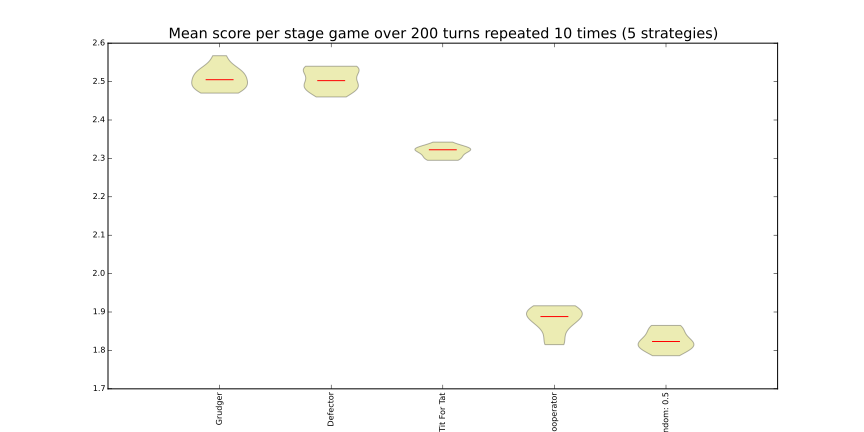
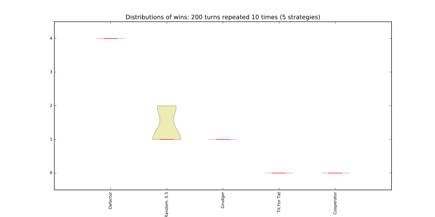
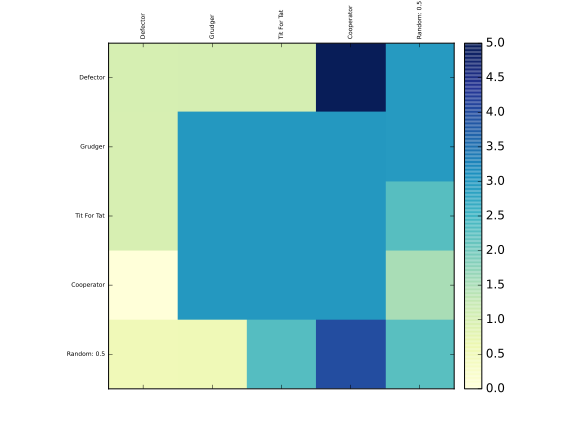

.. _visualising-results:

Visualising results
===================

This tutorial will show you briefly how to visualise some basic results

Visualising the results of the tournament
-----------------------------------------

As shown in :ref:`creating_tournaments`, let us create a tournament, but this
time we will include a player that acts randomly::

    >>> import axelrod as axl
    >>> players = [axl.Cooperator(), axl.Defector(),
    ...            axl.TitForTat(), axl.Grudger()]
    >>> players.append(axl.Random())
    >>> tournament = axl.Tournament(players)
    >>> results = tournament.play()

We can view these results (which helps visualise the stochastic effects)::

    >>> plot = axl.Plot(results)
    >>> p = plot.boxplot()
    >>> p.show()

Visualising the distributions of wins
-------------------------------------

We can view the distributions of wins for each strategy::

    >>> p = plot.winplot()
    >>> p.show()

Visualising the payoff matrix
-----------------------------

We can also easily view the payoff matrix described in
:ref:`tournament-results`, this becomes particularly useful when viewing the
outputs of tournaments with a large number of strategies::

    >>> p = plot.payoff()
    >>> p.show()

