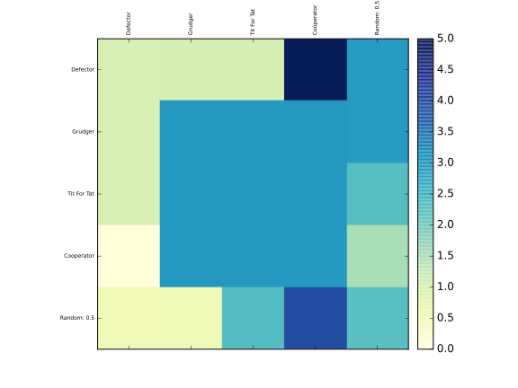

Visualising results
===================

lipsum

This tutorial will show you briefly how to visualise some basic results

Visualising the results of the tournament
-----------------------------------------

As shown in `Getting_started`_ let us create a tournament, but this time we will
include a strategy that acts randomly::

    >>> import axelrod as axl
    >>> strategies = [axl.Cooperator(), axl.Defector(),
    ...               axl.TitForTat(), axl.Grudger()]
    >>> strategies.append(axl.Random())
    >>> tournament = axl.Tournament(strategies)
    >>> results = tournament.play()

We can view these results (which helps visualise the stochastic effects)::

    >>> plot = axl.Plot(results)
    >>> p = plot.boxplot()
    >>> p.show()

.. image:: _static/visualising_results/demo_strategies_boxplot.svg
   :width: 50%
   :align: center

Visualising the payoff matrix
-----------------------------

We can also easily view the payoff matrix described in `Payoff_matrix`_, this
becomes particularly useful when viewing the outputs of tournaments with a large
number of strategies::

    >>> p = plot.payoff()
    >>> p.show()

