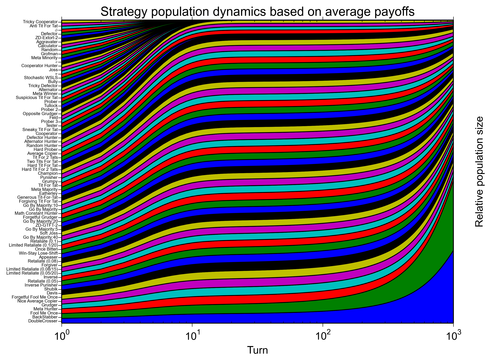

Usage
=====

This library is intended to allow for users to create their own tournaments (and incorporating various strategies as required) and comes with a script that runs the tournament with a variety of options:

1. `Using as a library`_
2. `Running the tournament`_

Installation
------------

The simplest way to install the package is to obtain it from the PyPi
repository::

    pip install axelrod

Take a look at this asciicast which demonstrates how to do this (and run a basic
tournament):

.. image:: https://asciinema.org/a/18590.png
    :width: 50%
    :align: center
    :target: https://asciinema.org/a/18590

You can also build it from source if you would like to::

    git clone https://github.com/Axelrod-Python/Axelrod.git
    cd Axelrod
    python setup.py install

Note also that you can use this package without needing to install it at all.
Simple unzip the tarbell available here:
`<https://pypi.python.org/packages/source/A/Axelrod/Axelrod-0.0.5.tar.gz>`_
uncompress it and you can run everything from within that directory.

Using as a library
------------------

Creating and running a tournament
^^^^^^^^^^^^^^^^^^^^^^^^^^^^^^^^^

We can list the so called 'basic strategies' by doing the following::

    import axelrod
    strategies = [s() for s in axelrod.basic_strategies]
    for s in strategies:
        print s

which gives::

    Alternator
    Cooperator
    Defector
    Random
    Tit For Tat

Before creating a tournament let us add another :code:`Defector` to our strategies::

    strategies.append(axelrod.Defector())

We can easily create a tournament with these basic strategies by doing the following::

    tournament = axelrod.Tournament(strategies)

To view the player types in our tournament::

    tournament.players

which gives::

    [Alternator, Cooperator, Defector, Random, Tit For Tat, Defector]

Now to run the tournament and save the results::

    results = tournament.play()

The output of `tournament.play()` is a `ResultSet` which is something that holds all the information we could need.
First, let us generate the scores::

    scores = results.generate_scores()
    scores

which gives::

    [[1.952, 1.943, 1.951, 1.96, 1.924, 1.943, 2.007, 1.966, 2.003, 1.963], [1.221, 1.185, 1.173, 1.218, 1.206, 1.218, 1.221, 1.224, 1.188, 1.221], [2.588, 2.616, 2.608, 2.632, 2.588, 2.624, 2.612, 2.532, 2.588, 2.564], [1.917, 1.896, 1.901, 1.884, 1.931, 1.896, 1.87, 1.912, 1.886, 1.899], [1.967, 1.94, 1.929, 1.934, 1.957, 1.959, 1.948, 1.95, 1.937, 1.955], [2.636, 2.664, 2.632, 2.592, 2.588, 2.644, 2.604, 2.572, 2.612, 2.588]]

We see here that when we ran :code:`tournament.play()` it automatically repeated the round robin tournament 10 times (this is to deal with the stochasticity of the random players).
The :code:`scores` contains a list of normalized scored for all players.

To generate a ranking based on median score we run::

    ranking = results.generate_ranking(scores)

which gives::

    ranking
    [2, 5, 0, 4, 3, 1]

Finally, to obtain the ranking in a helpful format with all the names we run::

    ranks = results.generate_ranked_names(ranking)

which gives::

    ranks
    ['Defector', 'Defector', 'Alternator', 'Tit For Tat', 'Random', 'Cooperator']

So in this particular instance our two defectors have won.
Let us write a little script that will throw in a new :code:`TitForTat` player until the tit for tat player wins::

    while ranks[0] == 'Defector':
       strategies.append(axelrod.TitForTat())  # Adding a new tit for tat player
       tournament = axelrod.Tournament(strategies)
       results = tournament.play()
       scores = results.generate_scores()
       ranking = results.generate_ranking(scores)
       ranks = results.generate_ranked_names(ranking)

Once that has run let us see how many :code:`TitForTat` players were required::

    ranks.count('Tit For Tat')

which gives::

    3

We can wrap all this in a function and use it to see how many :code:`TitForTat` are needed to overcome a varying number :code:`Defector`::

    def find_number_of_tit_for_tat(number_of_defectors):
       strategies = [s() for s in axelrod.basic_strategies]
       for d in range(number_of_defectors - 1):
            strategies.append(axelrod.Defector())
       ranks = ['Defector']  # Creating a dummy list to start
       count = 1
       while ranks[0] == 'Defector':
            count += 1
            strategies.append(axelrod.TitForTat())
            tournament = axelrod.Tournament(strategies)
            results = tournament.play()
            scores = results.generate_scores()
            ranking = results.generate_ranking(scores)
            ranks = results.generate_ranked_names(ranking)
       return count

Let us use that to find the number required for a range of number of :code:`Defector`::

    d = range(2, 50)
    t = [find_number_of_tit_for_tat(n) for n in d]

By viewing :code:`t` we actually see that even with 50 :code:`Defector` 3 :code:`TitForTat` is all that is needed to win the tournament::

    max(t)

gives::

    3

So even with a large quantity of :code:`Defector` only a small number of :code:`TitForTat` strategies is required.

Graphics
^^^^^^^^

The whole library can be used without any other non base Python libraries however if you have `matplotlib <http://matplotlib.org/>`_ installed on your system (this is installed automatically if you used :code:`pip install axelrod`) there are various graphical things coded in and ready to go.

Let us see the global scores for the basic strategies::

    import axelrod
    strategies = [s() for s in axelrod.basic_strategies]
    tournament = axelrod.Tournament(strategies)
    results = tournament.play()
    plot = axelrod.Plot(results)
    p = plot.boxplot()
    p.show()

We see the output of this here:

.. image:: _static/usage/basic_strategies.svg
   :width: 50%
   :align: center

If we run the same tournament but with 5 :code:`Defector` and 3 :code:`TitForTat` we get:

.. image:: _static/usage/basic_strategies-5-Defector-3-TitForTat.svg
   :width: 50%
   :align: center

Payoff matrix
^^^^^^^^^^^^^

Once a tournament has been run we can generate the payoff matrix that corresponds to it::

    import axelrod
    strategies = [s() for s in axelrod.basic_strategies]
    tournament = axelrod.Tournament(strategies)
    results = tournament.play()
    results.generate_payoff_matrix()

The output of this is a square matrix showing the payoffs (and another matrix showing the standard deviations) to the row player. Here is the payoff matrix::

     [[2.0, 4.0, 0.5, 2.26, 2.52],
      [1.5, 3.0, 0.0, 1.48, 3.0],
      [3.0, 5.0, 1.0, 3.03, 1.02],
      [2.25, 4.02, 0.50, 2.23, 2.26],
      [2.49, 3.0, 1.0, 2.25, 3.0]]

Again, if :code:`matplotlib` is installed we can visualise this::

    plot = axelrod.Plot(results)
    p = plot.payoff()
    p.show()

this is shown here:

.. image:: _static/usage/payoffs.svg
   :width: 50%
   :align: center

As an aside we can use this matrix with `gambit <http://gambit.sourceforge.net/>`_ or `sagemath <http://sagemath.org/>`_ to compute the Nash equilibria for the corresponding normal form game. Here is how to do this in Sage::

    # This is not part of the Axelrod module (run in Sage)
    A = matrix([[3.0 , 1.0 , 4.5 , 2.77 , 2.49],
               [3.5 , 2.0 , 5.0 , 3.499, 2.0],
               [2.0 , 0.0 , 4.0 , 1.96 , 3.98],
               [2.74, 1.00, 4.51, 2.77 , 2.71],
               [2.51, 2.0 , 4.01, 2.73 , 2.0]])
    g = NormalFormGame([A, A.transpose()])
    g.obtain_nash(maximization=False)

You can run the above code in a public `SageMathCloud sheet here <https://cloud.sagemath.com/projects/2caafc5b-408d-46cd-be4f-db5d1cb06886/files/axelrod.sagews>`_. The output is shown here::

    [[(0, 0, 0, 0, 1), (0, 0, 0, 0, 1)],
     [(0, 0, 0, 0, 1), (0, 49/149, 0, 0, 100/149)],
     [(0, 0, 198/199, 0, 1/199), (0, 0, 198/199, 0, 1/199)],
     [(0, 0, 1, 0, 0), (0, 0, 1, 0, 0)],
     [(0, 49/149, 0, 0, 100/149), (0, 0, 0, 0, 1)],
     [(0, 49/149, 0, 0, 100/149), (0, 49/149, 0, 0, 100/149)]]

Recall the ordering of the players::

    [Alternator, Cooperator, Defector, Random, Tit For Tat, Defector]

Thus we see that there are multiple Nash equilibria for this game. Two pure equilibria that involve both players playing :code:`Defector` and both players playing :code:`TitForTat`.

To further study how this system evolves over time and how robust some of the observations we have made are let us look at how this game can be interpreted in an ecological setting.

Ecological variant
^^^^^^^^^^^^^^^^^^

The previous examples seem to indicate that even with a large amount of :code:`Defector`, :code:`TitForTat` wins the tournament.
However, the Nash equilibria for the basic tournament shows that we have equilibria involving both those two strategies.

An ecological variant of the tournament can be run with this library which allows to see how each strategy does in a population over time where the performance in the tournament indicates how likely the given strategy is to reproduce.  To create such a variant simply run::

    import axelrod
    strategies = [s() for s in axelrod.basic_strategies]
    tournament = axelrod.Tournament(strategies)
    results = tournament.play()
    eco = axelrod.Ecosystem(results)
    eco.reproduce(50) # Evolve the population over 50 time steps
    plot = axelrod.Plot(results)
    p = plot.stackplot(eco.population_sizes)
    p.show()

We see the output here:

.. image:: _static/usage/basic_strategies-reproduce.svg
   :width: 50%
   :align: center

We see that the :code:`Defector` population starts to grow before the :code:`TitForTat` population takes over leaving some :code:`Cooperator` as well.
The final population is completely cooperative.

We can see how this differs when the initial population contains a large number of :code:`Defector`::

    import axelrod
    strategies = [s() for s in axelrod.basic_strategies]
    tournament = axelrod.Tournament(strategies)
    results = tournament.play()
    eco = axelrod.Ecosystem(results, population=[.1, .05, .7, .1, .05])
    eco.reproduce(50) # Evolve the population over 50 time steps
    plot = axelrod.Plot(results)
    p = plot.stackplot(eco.population_sizes)
    p.show()

We see the output here:

.. image:: _static/usage/basic_strategies-reproduce-large-initial-D.svg
   :width: 50%
   :align: center

Here is a with an even larger initial number of :code:`Defector` (note that it takes a little longer to stabilise)::

    import axelrod
    strategies = [s() for s in axelrod.basic_strategies]
    tournament = axelrod.Tournament(strategies)
    results = tournament.play()
    eco = axelrod.Ecosystem(results, population=[.1, .05, 7, .1, .05])
    eco.reproduce(140) # Evolve the population over 140 time steps
    plot = axelrod.Plot(results)
    p = plot.stackplot(eco.population_sizes)
    p.show()

The output is shown here:

.. image:: _static/usage/basic_strategies-reproduce-huge-initial-D.svg
   :width: 50%
   :align: center

Running the tournament
----------------------

Once :code:`axelrod` is installed you have access to a `run_axelrod` script that will
do most of what you need.

To view the help for the :code:`run_axelrod` file run::

    run_axelrod.py

Note that if you have not installed the package you can still used this script
directly from the repository::

    python run_axelrod -h

There are a variety of options that include:

- Excluding certain strategy sets.
- Not running the ecological variant.
- Running the rounds of the tournament in parallel.

Particular parameters can also be changed:

- The output directory for the plot and csv files.
- The number of turns and repetitions for the tournament.

Here is a command that will run the whole tournament, excluding the cheating strategies and using all available CPUS::

    run_axelrod --xc -p 0

Here are some of the plots that are output when running with the latest total number of strategies:

The results from the tournament itself (ordered by median score):

.. image:: ../assets/strategies_boxplot.png
   :width: 50%
   :align: center

The payoff matrix from that tournament:

.. image:: ../assets/strategies_payoff.png
   :width: 50%
   :align: center

The ecological variant:

